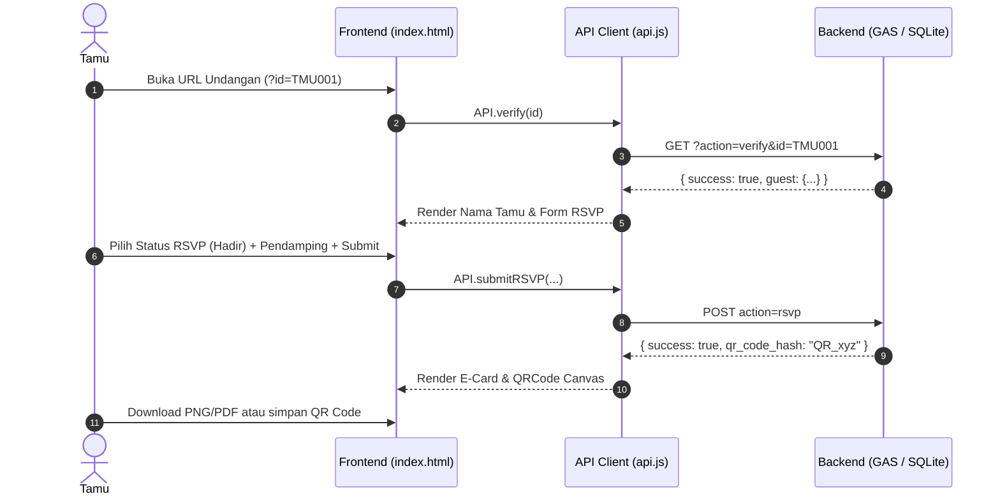
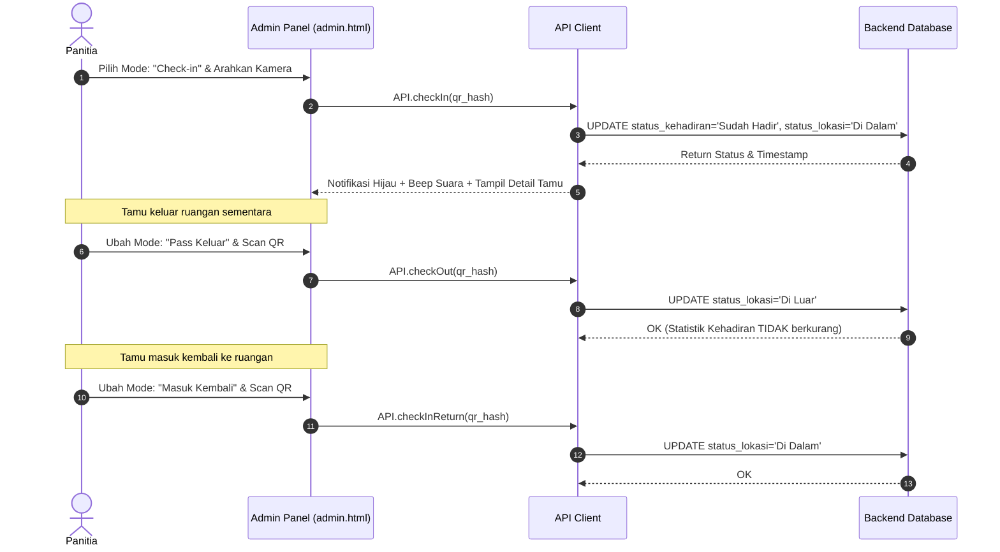

# ENVITATION - Dokumentasi Structural & Technical Codebase

Dokumen ini berisi pemetaan lengkap dari arsitektur, struktur berkas, skema data, API endpoint, serta modul-modul logika dalam proyek **ENVITATION** (Sistem Undangan Digital, RSVP, QR Code Check-In, dan Buku Tamu).

---

## 1. Overview & Arsitektur Sistem

**ENVITATION** adalah aplikasi web modular untuk manajemen acara (seperti Wisuda, Pernikahan, Seminar, dll.) yang menangani seluruh siklus kehadiran tamu:
1. **Verifikasi & Undangan Digital**: Tamu dapat melihat detail acara, countdown timer, dan mengisi konfirmasi kehadiran (RSVP).
2. **E-Card & QR Code**: Setelah RSVP disubmit, sistem menghasilkan E-Card berisi QR Code unik yang dapat diunduh (PNG/PDF) atau dibagikan via WhatsApp.
3. **Registrasi & Scanner QR di Lokasi**: Resepsionis/Panitia menggunakan Admin Panel untuk melakukan check-in tamu via QR Scanner atau pencarian manual.
4. **Logika Keluar-Masuk (In/Out Logic)**: Sistem melacak keberadaan tamu (*Di Dalam* vs *Di Luar* ruangan) tanpa menduplikasi statistik check-in.
5. **Buku Tamu Digital (Guestbook)**: Tamu dapat mengirimkan ucapan dan doa yang tampil secara real-time.
6. **Dual Backend Architecture**:
   - **Google Apps Script (GAS)**: Cloud backend tanpa server tambahan, data tersimpan di Google Sheets.
   - **Node.js + Express + SQLite**: Offline/Local backend untuk latensi ultra-cepat (~5ms), cocok untuk penggunaan di lokasi tanpa koneksi internet stabil.

---

## 2. Pohon Berkas Codebase

```
envitation/
├── deploy/
│   ├── nginx-production.conf      # Konfigurasi Nginx Reverse Proxy & Static Server
│   └── setup.sh                   # Script otomasi deployment VPS (PM2, Nginx, Certbot SSL)
├── docs/
│   └── codebase.md                # Dokumentasi codebase ini
├── src/
│   ├── backend/
│   │   └── Code.gs                # Web App REST API berbasis Google Apps Script
│   ├── backend-sqlite/
│   │   ├── .env.example           # Template variabel lingkungan SQLite backend
│   │   ├── .gitignore             # Git ignore untuk *.db & node_modules
│   │   ├── database.js            # Inisialisasi SQLite database, schema, & helpers
│   │   ├── import.js              # Script CLI import data dari CSV/JSON ke SQLite
│   │   ├── package.json           # Dependensi Node.js (express, sqlite3, rate-limit, helmet, dll.)
│   │   ├── routes.js              # Registrasi REST API endpoints & sanitasi data
│   │   └── server.js              # Entrypoint server Express & konfigurasi keamanan
│   ├── config/
│   │   └── config.js              # Konfigurasi terpusat (Event details, Theme, API URL, Backend type)
│   └── frontend/
│       ├── admin.html             # UI Panel Admin / Resepsionis (Scanner, Table, Stats)
│       ├── ecard.html             # UI E-Card Standalone
│       ├── index.html             # UI Landing Page Undangan Digital + RSVP + Guestbook
│       ├── css/
│       │   └── style.css          # Custom styling system, badges, layout, scanner feedback
│       ├── images/
│       │   └── logo.png           # Assets logo
│       └── js/
│           ├── admin.js           # Logika Admin Panel (Session, Scanner HTML5, CRUD, Import preview)
│           ├── api.js             # Unified API Client dengan auto-switch backend & retries
│           ├── guestbook.js       # Feed ucapan tamu & auto-refresh interval
│           ├── rsvp.js            # Verifikasi tamu, countdown, submit RSVP, E-Card render, status polling
│           └── utils.js           # Toast, Sound Web Audio, Vibrate, HTML2Canvas & jsPDF Export, WA Share
├── .gitignore                     # Root git ignore
├── dev.sh                         # Development launcher (GAS Mode)
├── dev-sqlite.sh                  # Development launcher (SQLite Mode)
└── README.md                      # Panduan penggunaan & instalasi
```

---

## 3. Skema Data & Database

### A. Tabel `data_tamu`
Tabel utama yang menyimpan seluruh entitas tamu undangan.

| Nama Kolom | Tipe Data (SQLite) | Tipe (Google Sheets) | Deskripsi | Nilai Default / Contoh |
|------------|-------------------|----------------------|-----------|------------------------|
| `id` | `INTEGER PRIMARY KEY AUTOINCREMENT` | Baris (Index + 1) | ID internal auto-increment | `1`, `2` |
| `id_tamu` | `TEXT UNIQUE NOT NULL` | Kolom A (0) | ID Unik Tamu | `TMU001` |
| `nama_tamu` | `TEXT NOT NULL` | Kolom B (1) | Nama Lengkap Tamu | `Budi Santoso` |
| `instansi_kategori` | `TEXT` | Kolom C (2) | Kategori/Instansi | `VIP`, `Dosen`, `Wisudawan` |
| `no_hp` | `TEXT` | Kolom D (3) | Nomor WhatsApp/HP | `081234567890` |
| `email` | `TEXT` | Kolom E (4) | Email Tamu | `budi@example.com` |
| `status_rsvp` | `TEXT` | Kolom F (5) | Status konfirmasi | `Belum Konfirmasi`, `Hadir`, `Tentatif`, `Tidak Hadir` |
| `jumlah_pendamping` | `INTEGER` | Kolom G (6) | Jumlah pendamping | `0`, `1`, `2` |
| `qr_code_hash` | `TEXT UNIQUE` | Kolom H (7) | Token unik QR Code | `QR_a1b2c3d4e5f6g7h8` |
| `status_kehadiran` | `TEXT` | Kolom I (8) | Status check-in awal | `Belum Hadir`, `Sudah Hadir` |
| `status_lokasi` | `TEXT` | Kolom J (9) | Status lokasi fisik saat ini | `Di Luar`, `Di Dalam` |
| `waktu_checkin` | `TEXT` | Kolom K (10) | Timestamp check-in pertama | `2026-08-24 07:15:30` |
| `komentar_rsvp` | `TEXT` | Kolom L (11) | Catatan saat RSVP | `"Insya Allah hadir jam 7"` |
| `catatan_admin` | `TEXT` | Kolom M (12) | Catatan internal panitia | `"Tempat duduk Baris A-12"` |
| `created_at` | `TEXT` | - | Timestamp dibuat (SQLite) | `datetime('now', 'localtime')` |
| `updated_at` | `TEXT` | - | Timestamp diubah (SQLite) | `datetime('now', 'localtime')` |

### B. Tabel `data_ucapan`
Tabel untuk fitur Buku Tamu / Ucapan Digital.

| Nama Kolom | Tipe Data (SQLite) | Tipe (Google Sheets) | Deskripsi |
|------------|-------------------|----------------------|-----------|
| `id` | `INTEGER PRIMARY KEY AUTOINCREMENT` | Baris | ID Ucapan |
| `id_tamu` | `TEXT` | Kolom B | Reference ID Tamu |
| `nama` | `TEXT NOT NULL` | Kolom C | Nama Pengirim |
| `ucapan` | `TEXT NOT NULL` | Kolom D | Isi Pesan / Doa |
| `created_at` | `TEXT` | Kolom E | Timestamp Pengiriman |

---

## 4. Rincian Modul & Komponen

### 4.1. Konfigurasi Terpusat (`src/config/config.js`)
Pusat pengaturan seluruh elemen aplikasi. Didesain agar mudah digunakan kembali (reusable) untuk event baru tanpa mengubah kode logika.
- **`EVENT`**: Judul event, penyelenggara, tanggal, ISO timestamp (untuk countdown), lokasi, embed Google Maps link, dresscode.
- **`THEME`**: Palette warna utama (slate, amber gold, success green, danger red).
- **`API`**: `baseUrl`, timeout (15000ms), max retries (2).
- **`BACKEND`**: Menentukan jenis backend aktif (`"sqlite"` atau `"gas"`) serta URL masing-masing backend.
- **`ADMIN`**: Pengaturan label PIN Admin.
- **`SHARE`**: Template pesan WhatsApp saat membagikan E-Card.
- **`SHEET`**: Mapping nama sheet dan indeks kolom untuk Google Sheets mode.

---

### 4.2. Dual Backend Implementation

#### A. Backend Google Apps Script (`src/backend/Code.gs`)
- **Single Entrypoint**: `doGet(e)` dan `doPost(e)` diarahkan ke `handleRequest(e)`.
- **JSON Output**: Mengembalikan objek JSON dengan properti `success` (boolean) dan `message` / `data`.
- **Key Functions**:
  - `verifyGuest`: Memvalidasi keberadaan tamu berdasarkan `id` atau `nama` + `no_hp`.
  - `submitRSVP`: Mengubah `status_rsvp`, `jumlah_pendamping`, dan `komentar_rsvp`.
  - `checkIn`: Mengubah `status_kehadiran` → `Sudah Hadir` & `status_lokasi` → `Di Dalam` serta mencatat `waktu_checkin`. Mengembalikan error `duplicate: true` jika tamu sudah di dalam.
  - `checkOut`: Mengubah `status_lokasi` → `Di Luar`.
  - `checkInReturn`: Mengubah `status_lokasi` → `Di Dalam`.
  - `searchGuests`: Mendukung pencarian berdasar `nama`, `id_tamu`, `no_hp`, atau `instansi_kategori`.
  - `getStats`: Menghitung agregasi real-time (Total, Hadir, Tentatif, Tidak Hadir, Belum Konfirmasi, Sudah Check-in, Di Dalam, Di Luar, Total Pendamping, Breakdown Kategori).
  - `addGuest` / `importGuest`: Menambahkan tamu baru on-the-spot atau massal.
  - `deleteGuest` / `deleteGuests` / `deleteAllGuests` / `resetStatus`: Manajemen & pembersihan data.

#### B. Backend SQLite (`src/backend-sqlite/`)
- **`server.js`**:
  - **Security Headers**: Memakai `helmet` (frameguard `sameorigin`).
  - **Rate Limiting**: `express-rate-limit` membatasi max 100 req / 15 menit (umum) dan 20 req / 15 menit (admin endpoints).
  - **CORS Configuration**: Mengunci origin ke domain terdaftar (`ALLOWED_ORIGIN`).
  - **Graceful Shutdown**: Menutup koneksi database pada sinyal `SIGINT` dan `SIGTERM`.
- **`database.js`**:
  - Menyediakan wrapper Promise (`run`, `get`, `all`) di atas library `sqlite3`.
  - Otomatis membuat tabel `data_tamu` dan `data_ucapan` beserta indeks pendukung (`idx_id_tamu`, `idx_qr_hash`, `idx_status_rsvp`, `idx_ucapan_tamu`) saat server diaktifkan.
- **`routes.js`**:
  - Sanitasi ketat terhadap input HTML/SQL injection (`sanitize`, `sanitizeId`, `sanitizePhone`, `sanitizeEmail`).
  - Pencatatan log audit internal (`auditLog`).
  - Menangani aksi GET/POST identik dengan versi GAS untuk transparansi di frontend.
- **`import.js`**:
  - Tool CLI (`node import.js --csv file.csv` atau `--json file.json`) untuk pengisian data massal secara offline.

---

### 4.3. Client Frontend Architecture (`src/frontend/js/`)

#### A. `api.js` (Unified API Layer)
- Secara otomatis menentukan `baseUrl` dari `CONFIG.BACKEND.type`.
- Mengimplementasikan pola **Retry with Exponential Backoff** dan **AbortController Timeout**.
- Mengabstraksi seluruh panggilan API (`verify`, `submitRSVP`, `checkIn`, `checkOut`, `checkInReturn`, `search`, `getStats`, `addGuest`, `importGuest`, `getUcapan`, `addUcapan`, dll.).

#### B. `rsvp.js` (Logika Tamu & Undangan)
- **`init()`**: Mengisi detail acara dari `CONFIG.EVENT`, memulai countdown timer 1 detik, memasang event listener pada form RSVP.
- **`checkUrlParam()`**: Memeriksa parameter URL `?id=TMUxxx`. Jika ada, langsung mengeksekusi verifikasi otomatis.
- **`verifyGuest()`**: Memvalidasi identitas tamu. Jika berhasil, menampilkan section undangan, RSVP, dan buku tamu.
- **`submitRSVP()`**: Menyimpan status RSVP dan pendamping, lalu memicu pembentukan E-Card (`renderECard()`).
- **`renderECard()`**: Menampilkan QR Code menggunakan library `qrcode.js` dan memulai `startStatusPolling()` (setiap 10 detik) untuk memantau perubahan status lokasi fisik tamu.

#### C. `admin.js` (Logika Panel Admin & Resepsionis)
- **Session Management**: Memverifikasi PIN Admin melalui API. PIN disimpan sementara di `sessionStorage` dengan waktu kadaluarsa (12 jam).
- **Tab Switching**: Navigasi antara Dashboard, Scanner QR, Data Tamu, dan Buku Tamu dengan hash URL (`#dashboard`, `#scanner`, dll.).
- **QR Scanner (`html5-qrcode`)**:
  - Mendukung 3 Mode Operasi: **Check-in**, **Pass Keluar**, **Masuk Kembali**.
  - Mengelola *scan cooldown* (3 detik) untuk mencegah pemindaian berulang yang tidak sengaja.
  - Menghasilkan umpan balik visual (overlay hijau/merah), suara (*audio synthesizer synth chime/beep*), dan getaran (vibration API).
- **CRUD & Bulk Import**:
  - Menyediakan form penambahan tamu *on-the-spot*.
  - Menyediakan parser CSV/JSON client-side dengan modal preview data sebelum diimport.
  - Seleksi baris masal (*Check-all*) untuk penghapusan massal.
  - Modal detail tamu untuk pembaruan *Catatan Admin*.

#### D. `guestbook.js` (Logika Buku Tamu)
- Memuat ucapan terbaru (`API.getUcapan()`) dan melakukan *auto-refresh* setiap 30 detik.
- Mengamankan tampilan ucapan dengan melepaskan tag HTML (*HTML Entity Escaping*).
- Menghitung label relatif waktu (*"Baru saja"*, *"5 menit lalu"*, *"2 jam lalu"*).

#### E. `utils.js` (Helper & Utility)
- **`showToast(message, type)`**: Sistem notifikasi toast melayang di kanan atas.
- **`playSound(type)`**: Sintesis suara menggunakan **Web Audio API** (`AudioContext`) tanpa dependensi berkas MP3 eksternal.
- **`vibrate(pattern)`**: Penggunaan Haptic Feedback API.
- **Badge Generators**: Mengembalikan komponen HTML Badge berdistribusi warna untuk Status RSVP, Kehadiran, dan Lokasi.
- **Export E-Card**:
  - **`downloadAsPNG()`**: Render Canvas DOM via `html2canvas` (scale 4x HD).
  - **`downloadAsPDF()`**: Mengubah canvas menjadi dokumen PDF siap cetak ukuran A6 via `jsPDF`.
- **`shareToWhatsApp()`**: Membuka WhatsApp Web/App dengan teks ucapan terformat dan URL E-Card.

---

## 5. Alur Operasional Sistem (Operational Flows)

### Flow 1: Siklus Tamu (RSVP → Check-in)


### Flow 2: Siklus Check-in & In/Out Logic di Lokasi Acara


---

## 6. Script Deployment & Infrastruktur (`deploy/`)

1. **`dev.sh`**: Menjalankan server HTTP Python lokal di port 8081 untuk pengembangan mode Google Sheets.
2. **`dev-sqlite.sh`**: Menjalankan simultan backend Node.js (port 3001) dan frontend HTTP Python (port 8081) dengan penanganan sinyal penutupan otomatis (`trap INT TERM`).
3. **`deploy/setup.sh`**: Script bash otomasi deployment di server VPS Ubuntu/Debian:
   - Memeriksa file `.env`.
   - Menginstall **PM2** Process Manager secara global.
   - Mengonfigurasi Nginx site config dan mengaktifkan SSL HTTPS via **Certbot (Let's Encrypt)**.
   - Menjalankan backend SQLite dengan PM2 (`pm2 start server.js --name envitation-backend`).
   - Mendaftarkan PM2 ke systemd startup daemon.
4. **`deploy/nginx-production.conf`**:
   - Menghubungkan endpoint `/api/` ke Node.js backend Express via `proxy_pass http://127.0.0.1:3000/`.
   - Mengarahkan sisa request ke direktori static `src/frontend/`.
   - Menambahkan header keamanan (`X-Frame-Options`, `X-Content-Type-Options`, `X-XSS-Protection`).

---

## 7. Ringkasan Kepatuhan & Fitur Keamanan

- **Keamanan PIN Admin**: PIN Admin tidak pernah di-*hardcode* pada file JavaScript frontend; PIN diverifikasi ke backend dan hanya disimpan sementara di `sessionStorage` pada browser panitia.
- **Pembersihan Input Data**: Input teks di-sanitize dari skrip jahat HTML/JS menggunakan penggantian karakter entitas (`&lt;`, `&gt;`, `&amp;`, dll.).
- **Perlindungan Bruteforce**: Implements rate-limiting pada endpoint admin dan pencarian tamu.
- **Ketahanan Jaringan**: Frontend mampu menangani kegagalan jaringan singkat melalui *retry logic* otomatis pada `api.js`.
